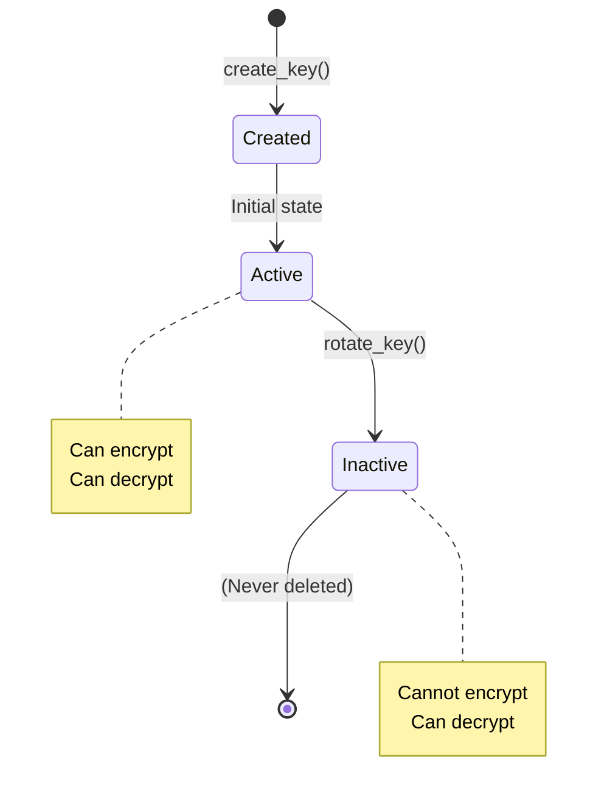

QIMEM implements a **lineage-based key rotation** system that enables cryptographic agility while maintaining backward compatibility for decryption.

## Key Lifecycle States



## Key Metadata Structure

```rust
#[derive(Debug, Clone, Serialize, Deserialize)]
pub struct KeyMetadata {
    /// Key identifier.
    pub key_id: Uuid,
    /// Lineage identifier.
    pub lineage_id: Uuid,
    /// Rotation version.
    pub version: i32,
    /// Whether key is active for encryption.
    pub active: bool,
}
```

Source: `src/keystore/mod.rs:19-29`

### Field Semantics

<AccordionGroup>
  <Accordion title="key_id (Uuid)">
    Unique identifier for this specific key version.
    
    - Generated via `Uuid::new_v4()` on creation or rotation
    - Used as primary lookup key in storage
    - Stored in `Envelope.key_id` field after encryption
  </Accordion>
  
  <Accordion title="lineage_id (Uuid)">
    Identifier shared across all versions in a rotation chain.
    
    - Equal to the **first key's** `key_id` in the lineage
    - Enables querying all versions of a rotated key
    - Immutable across rotations
    
    **Example lineage:**
    ```
    Key 1: key_id=A, lineage_id=A, version=1  (root)
    Key 2: key_id=B, lineage_id=A, version=2  (rotated)
    Key 3: key_id=C, lineage_id=A, version=3  (rotated)
    ```
  </Accordion>
  
  <Accordion title="version (i32)">
    Monotonically increasing version number within the lineage.
    
    - Root key starts at `version=1`
    - Incremented by 1 on each rotation
    - Enables auditing rotation history
  </Accordion>
  
  <Accordion title="active (bool)">
    Whether this key version can be used for **new encryptions**.
    
    - Only the **latest version** in a lineage is active
    - Inactive keys can still decrypt old envelopes
    - Attempting to encrypt with inactive key returns `QimemError::KeyInactive`
  </Accordion>
</AccordionGroup>

## Key Material Structure

```rust
#[derive(Debug, Clone)]
pub struct KeyMaterial {
    /// Key identifier.
    pub key_id: Uuid,
    /// Encryption key bytes.
    pub material: Zeroizing<Vec<u8>>,
    /// Active status.
    pub active: bool,
}
```

Source: `src/keystore/mod.rs:32-40`

<Info>
  **Security**: The `material` field uses `zeroize::Zeroizing` to ensure key bytes are securely erased from memory when dropped. See [Security](/architecture/security) for details.
</Info>

## Key Store Operations

The `KeyStore` trait defines the key lifecycle contract:

```rust
pub trait KeyStore: Send + Sync {
    /// Create a new root key.
    fn create_key(&self) -> Result<KeyMetadata>;
    /// Retrieve key material by key id.
    fn get_key(&self, key_id: Uuid) -> Result<KeyMaterial>;
    /// Rotate a key and return the new active version.
    fn rotate_key(&self, key_id: Uuid) -> Result<KeyMetadata>;
}
```

Source: `src/keystore/mod.rs:43-50`

### Operation Details

<Tabs>
  <Tab title="create_key()">
    Creates a new **root key** (the first key in a lineage).
    
    **Process:**
    1. Generate new UUID for `key_id`
    2. Set `lineage_id = key_id` (root property)
    3. Set `version = 1`
    4. Set `active = true`
    5. Generate 32 random bytes for key material via `OsRng`
    6. Store key and return metadata
    
    **Implementation (InMemoryKeyStore):**
    ```rust
    fn create_key(&self) -> Result<KeyMetadata> {
        let key_id = Uuid::new_v4();
        let lineage_id = key_id;
        let metadata = KeyMetadata {
            key_id,
            lineage_id,
            version: 1,
            active: true,
        };
        let stored = StoredKey {
            metadata: metadata.clone(),
            material: generate_key_material().to_vec(),
        };
        self.keys.write()?.insert(key_id, stored);
        self.lineages.write()?.insert(lineage_id, key_id);
        Ok(metadata)
    }
    ```
    Source: `src/keystore/memory.rs:23-45`
  </Tab>
  
  <Tab title="get_key()">
    Retrieves key material for encryption or decryption.
    
    **Process:**
    1. Lookup `key_id` in storage
    2. Return `QimemError::KeyNotFound` if missing
    3. Return `KeyMaterial` with wrapped bytes and active status
    
    **Implementation (InMemoryKeyStore):**
    ```rust
    fn get_key(&self, key_id: Uuid) -> Result<KeyMaterial> {
        let keys = self.keys.read()?;
        let stored = keys.get(&key_id)
            .ok_or(QimemError::KeyNotFound(key_id))?;
        Ok(KeyMaterial {
            key_id,
            material: zeroize::Zeroizing::new(stored.material.clone()),
            active: stored.metadata.active,
        })
    }
    ```
    Source: `src/keystore/memory.rs:47-58`
    
    <Note>
      The `active` flag is **not checked** during `get_key()`. The caller (e.g., `CryptoEngine::encrypt`) is responsible for enforcing active-only encryption.
    </Note>
  </Tab>
  
  <Tab title="rotate_key()">
    Creates a new active version and deactivates the old key.
    
    **Process:**
    1. Lookup old key by `key_id`
    2. Return `QimemError::KeyNotFound` if missing
    3. Set old key's `active = false`
    4. Generate new UUID for new key
    5. Set `lineage_id = old.lineage_id` (inherit lineage)
    6. Set `version = old.version + 1`
    7. Set `active = true`
    8. Generate new 32 random bytes for key material
    9. Store new key and return metadata
    
    **Implementation (InMemoryKeyStore):**
    ```rust
    fn rotate_key(&self, key_id: Uuid) -> Result<KeyMetadata> {
        let mut keys = self.keys.write()?;
        let old = keys.get_mut(&key_id)
            .ok_or(QimemError::KeyNotFound(key_id))?;
        old.metadata.active = false;

        let new_id = Uuid::new_v4();
        let metadata = KeyMetadata {
            key_id: new_id,
            lineage_id: old.metadata.lineage_id,
            version: old.metadata.version + 1,
            active: true,
        };
        let new = StoredKey {
            metadata: metadata.clone(),
            material: generate_key_material().to_vec(),
        };
        keys.insert(new_id, new);
        self.lineages.write()?.insert(metadata.lineage_id, new_id);
        Ok(metadata)
    }
    ```
    Source: `src/keystore/memory.rs:60-87`
  </Tab>
</Tabs>

## Rotation Design

From the README:

> **Key rotation design**
> - Rotation creates a new active key record and deactivates the old key.
> - Old keys remain available for decrypt compatibility.
> - Inactive keys are rejected for encryption.

Source: `README.md:32-35`

### Why Rotation Matters

<CardGroup cols={2}>
  <Card title="Compliance" icon="scale-balanced">
    Many security standards (PCI-DSS, HIPAA, etc.) require periodic key rotation.
  </Card>
  
  <Card title="Blast Radius" icon="bomb">
    Limits the amount of data encrypted with a single key, reducing impact of key compromise.
  </Card>
  
  <Card title="Forward Secrecy" icon="arrow-right">
    Old data remains encrypted with old keys even after rotation.
  </Card>
  
  <Card title="Zero Downtime" icon="circle-check">
    Old envelopes decrypt seamlessly during and after rotation.
  </Card>
</CardGroup>

## Storage Backend Comparison

<Tabs>
  <Tab title="InMemoryKeyStore">
    Stateless storage using `RwLock<HashMap<Uuid, StoredKey>>`.
    
    **Structure:**
    ```rust
    #[derive(Debug, Default)]
    pub struct InMemoryKeyStore {
        keys: RwLock<HashMap<Uuid, StoredKey>>,
        lineages: RwLock<HashMap<Uuid, Uuid>>,
    }
    ```
    Source: `src/keystore/memory.rs:16-20`
    
    **Properties:**
    - Keys lost on process restart
    - No persistence between CLI invocations
    - Suitable for testing and stateless API mode
    - Lock contention on high concurrency
    
    **Use Case:** Development, testing, ephemeral environments
  </Tab>
  
  <Tab title="PostgresKeyStore">
    Persistent storage using PostgreSQL with transactional rotation.
    
    **Structure:**
    ```rust
    #[derive(Debug, Clone)]
    pub struct PostgresKeyStore {
        pool: PgPool,
    }
    ```
    Source: `src/keystore/postgres.rs:8-11`
    
    **Schema (migrations):**
    ```sql
    CREATE TABLE keys (
        key_id UUID PRIMARY KEY,
        lineage_id UUID NOT NULL,
        version INT NOT NULL,
        active BOOLEAN NOT NULL,
        material BYTEA NOT NULL,
        created_at TIMESTAMPTZ DEFAULT NOW()
    );
    ```
    
    **Rotation Transaction:**
    ```rust
    let mut tx = self.pool.begin().await?;
    // 1. Lookup old key
    let row = sqlx::query("SELECT lineage_id, version FROM keys WHERE key_id=$1")
        .bind(key_id)
        .fetch_optional(&mut *tx)
        .await?
        .ok_or(QimemError::KeyNotFound(key_id))?;
    // 2. Deactivate old key
    sqlx::query("UPDATE keys SET active=false WHERE key_id=$1")
        .bind(key_id)
        .execute(&mut *tx)
        .await?;
    // 3. Insert new active key
    sqlx::query("INSERT INTO keys (...) VALUES (...)")
        // ...
        .execute(&mut *tx)
        .await?;
    tx.commit().await?;
    ```
    Source: `src/keystore/postgres.rs:68-95`
    
    **Properties:**
    - Keys persist across restarts
    - ACID guarantees for rotation
    - Scales horizontally with Postgres replicas
    - Requires `stateful` feature flag
    
    **Use Case:** Production, multi-instance deployments
  </Tab>
</Tabs>

## Key Material Generation

All backends use the same secure key generation:

```rust
pub(crate) fn generate_key_material() -> Zeroizing<Vec<u8>> {
    let mut key = vec![0_u8; 32];
    OsRng.fill_bytes(&mut key);
    Zeroizing::new(key)
}
```

Source: `src/keystore/mod.rs:52-56`

<Info>
  **32 bytes (256 bits)** is the required key size for AES-256-GCM. ChaCha20-Poly1305 also uses 256-bit keys.
</Info>

## Error Handling

| Error | When | Recovery |
|-------|------|----------|
| `KeyNotFound(Uuid)` | `get_key()` or `rotate_key()` on unknown key | Ensure key was created |
| `KeyInactive(Uuid)` | Attempting to encrypt with inactive key | Rotate key or use active version |
| `Config(String)` | Lock poisoning (in-memory) or connection errors (Postgres) | Restart or fix database |

Source: `src/error.rs:20-37`

## Best Practices

<Steps>
  <Step title="Rotate Regularly">
    Establish a rotation schedule (e.g., every 90 days) based on compliance requirements.
  </Step>
  
  <Step title="Never Delete Old Keys">
    Inactive keys must remain available to decrypt historical envelopes.
  </Step>
  
  <Step title="Track Lineage">
    Use `lineage_id` to query all versions of a key for auditing.
  </Step>
  
  <Step title="Use Postgres in Production">
    The in-memory store loses keys on restart. Use `stateful` mode for persistence.
  </Step>
  
  <Step title="Monitor Active Keys">
    Alert if multiple keys in the same lineage are active (indicates rotation bug).
  </Step>
</Steps>

## See Also

<CardGroup cols={2}>
  <Card title="Envelope Format" icon="envelope" href="/architecture/envelope-format">
    How `key_id` is embedded in envelopes
  </Card>
  <Card title="Security" icon="shield-halved" href="/architecture/security">
    Key material protection with zeroize
  </Card>
  <Card title="API Reference" icon="code" href="/library/keystore">
    Full KeyStore trait documentation
  </Card>
</CardGroup>