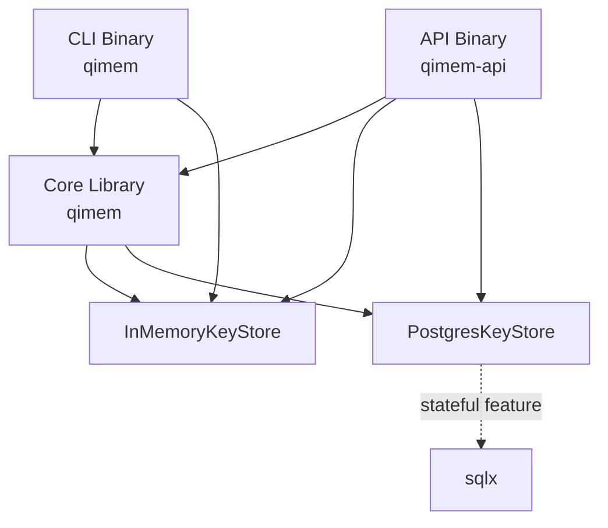

QIMEM is designed as a focused encryption engine with three architectural layers:

## Three-Tier Architecture

### 1. Core Library (`qimem`)

The `qimem` Rust library provides:

- **Crypto engine**: Deterministic envelope encryption using AES-256-GCM (with optional ChaCha20-Poly1305)
- **Envelope format**: Versioned binary and JSON serialization (see [Envelope Format](/architecture/envelope-format))
- **Key store traits**: Pluggable storage backends
- **Storage implementations**:
  - `InMemoryKeyStore`: Stateless in-memory storage using `RwLock<HashMap>`
  - `PostgresKeyStore`: Persistent storage with transactional rotation (requires `stateful` feature flag)

```rust
pub trait KeyStore: Send + Sync {
    fn create_key(&self) -> Result<KeyMetadata>;
    fn get_key(&self, key_id: Uuid) -> Result<KeyMaterial>;
    fn rotate_key(&self, key_id: Uuid) -> Result<KeyMetadata>;
}
```

Source: `src/keystore/mod.rs:43-50`

### 2. HTTP API Binary (`qimem-api`)

The API binary (`src/bin/qimem-api.rs`) provides:

- **Axum HTTP server** with JSON endpoints
- **Mode selection**: Configurable via `QIMEM_MODE` environment variable
  - `stateless`: Uses `InMemoryKeyStore` (no persistence)
  - `stateful`: Uses `PostgresKeyStore` with migrations
- **Runtime configuration**: Bind address via `QIMEM_BIND` (default: `0.0.0.0:8080`)

```rust
let store: Arc<dyn KeyStore> = match config.mode {
    Mode::Stateless => Arc::new(InMemoryKeyStore::default()),
    Mode::Stateful => Arc::new(PostgresKeyStore::connect(url).await?),
};
```

Source: `src/bin/qimem-api.rs:24-41`

**API Endpoints:**

| Endpoint | Method | Purpose |
|----------|--------|----------|
| `/health` | GET | Health check (returns `{"status":"ok"}`) |
| `/keys` | POST | Create new root key |
| `/encrypt` | POST | Encrypt plaintext with key ID |
| `/decrypt` | POST | Decrypt envelope |
| `/rotate` | POST | Rotate key to new version |

Source: `src/api/mod.rs:26-34`

### 3. CLI Binary (`qimem`)

The CLI binary (`src/bin/qimem.rs`) provides:

- **Local operations**: Key generation, encryption, decryption, rotation
- **In-memory only**: Uses `InMemoryKeyStore` (no persistence between invocations)
- **Base64 encoding**: Envelopes are base64-encoded for portability
- **JSON output**: All commands output JSON for scripting

```rust
enum Commands {
    Keygen,
    Encrypt { key_id: Uuid, input: String },
    Decrypt { input: String },
    Rotate { key_id: Uuid },
}
```

Source: `src/bin/qimem.rs:15-32`

## Component Dependencies



## Design Principles

<CardGroup cols={2}>
  <Card title="No Unsafe Code" icon="shield-check">
    `#![deny(unsafe_code)]` enforced at the library level
  </Card>
  <Card title="Complete Documentation" icon="book">
    `#![deny(missing_docs)]` ensures every public item is documented
  </Card>
  <Card title="Memory Safety" icon="lock">
    Key material wrapped in `zeroize::Zeroizing` for secure cleanup
  </Card>
  <Card title="Pluggable Storage" icon="database">
    Storage backend abstracted through `KeyStore` trait
  </Card>
</CardGroup>

Source: `src/lib.rs:1-2`

## Feature Flags

- **`stateful`**: Enables `PostgresKeyStore` and sqlx dependencies
- **`chacha`**: Adds ChaCha20-Poly1305 algorithm support (ID: 2)

Without feature flags, the library uses only:
- AES-256-GCM (algorithm ID: 1)
- `InMemoryKeyStore`

## Next Steps

<CardGroup cols={2}>
  <Card title="Envelope Format" icon="envelope" href="/architecture/envelope-format">
    Deep dive into the v1 binary and JSON serialization formats
  </Card>
  <Card title="Key Lifecycle" icon="rotate" href="/architecture/key-lifecycle">
    Understand key creation, rotation, and versioning
  </Card>
  <Card title="Security" icon="shield-halved" href="/architecture/security">
    Security features and key material handling
  </Card>
  <Card title="Storage Backends" icon="database" href="/library/keystore">
    API reference for KeyStore implementations
  </Card>
</CardGroup>